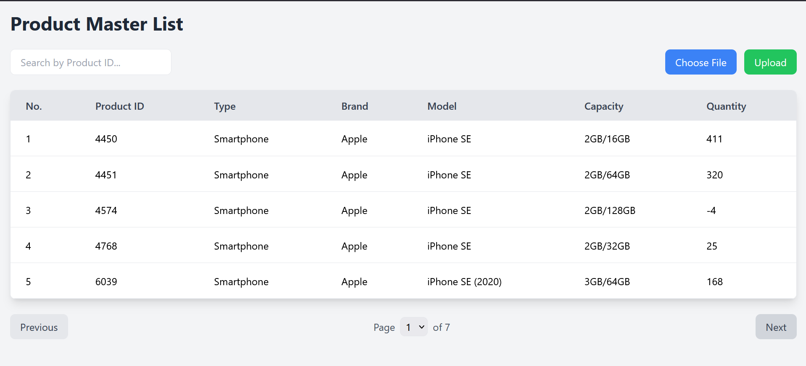

# 🛍️ Product Management Application
---
## ✨ Features

- 📦 **Product Master List**: Manage your products with ease.
- 📤 **Excel Upload**: Update quantities in bulk using Excel files.
- ⏳ **Asynchronous Processing**: Powered by Laravel Queues for smooth uploads.
- 🔍 **Smart Search**: Debounced search input for better performance.
- 📊 **Real-time Feedback**: Upload status & notifications.

---

## 🧰 Tech Stack

| Technology        | Description                              |
|------------------|------------------------------------------|
| Laravel 10.x      | Backend framework 🧬                    |
| Vue.js 3.x        | Frontend framework 🖼️                   |
| Tailwind CSS      | Modern styling with utility classes 🎨   |
| PhpSpreadsheet    | Excel reading/writing 📑                |
| Axios             | HTTP client for API requests 🔗         |
| Lodash            | JS utilities like `debounce` 🧠          |
| MySQL             | Database (default) 🗄️                   |
| Laravel Queues    | Async job processing 🎯                 |

---

## 📸 Screenshots

- 
- 
---

## ⚙️ Prerequisites

Make sure you have the following installed:

- ✅ PHP 8.1 or later
- ✅ Composer
- ✅ Node.js (v16+ recommended)
- ✅ npm or Yarn
- ✅ MySQL or compatible DB
- ✅ Laravel Installer (optional)

---

## 🛠️ Installation

# Clone the repository
git clone https://github.com/your-username/product-management-app.git
cd product-management-app

# Install PHP dependencies
composer install

# Install JavaScript dependencies
npm install

# Copy environment variables
cp .env.example .env

## 🐬 MySQL Setup

# Step 1: Create a Database
CREATE DATABASE product_management;

# Step 2: Configure .env
Edit your .env file:
DB_CONNECTION=mysql
DB_HOST=127.0.0.1
DB_PORT=3306
DB_DATABASE=product_management
DB_USERNAME=root
DB_PASSWORD=your_password

##  🧪 Run Migrations and Seeders
php artisan migrate

# Seed initial product data
php artisan db:seed --class=ProductMasterListSeeder

##  📦 Queue Configuration

# Step 1: Set Driver to database in .env
QUEUE_CONNECTION=database

# Step 2: Create jobs table
php artisan queue:table
php artisan migrate

# Step 3: Start Queue Worker
php artisan queue:work

## 🖥️ Serve the Application

# Start Laravel backend
php artisan serve

# In another terminal, compile frontend
npm run dev

Then visit: http://localhost:8000 🚀